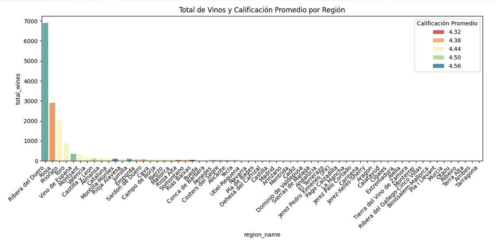
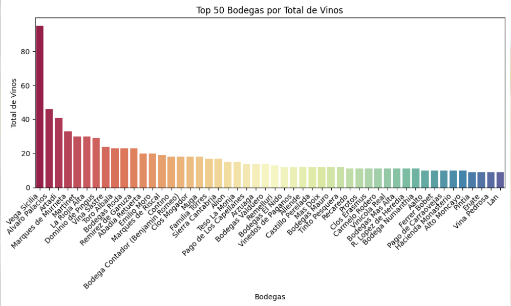
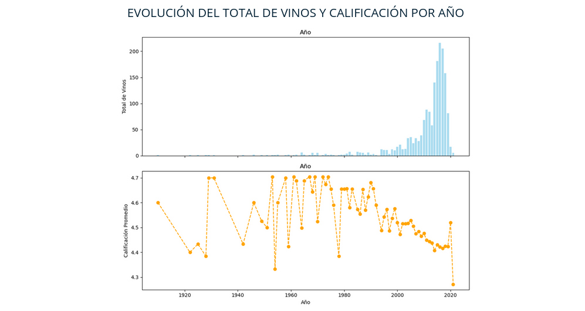
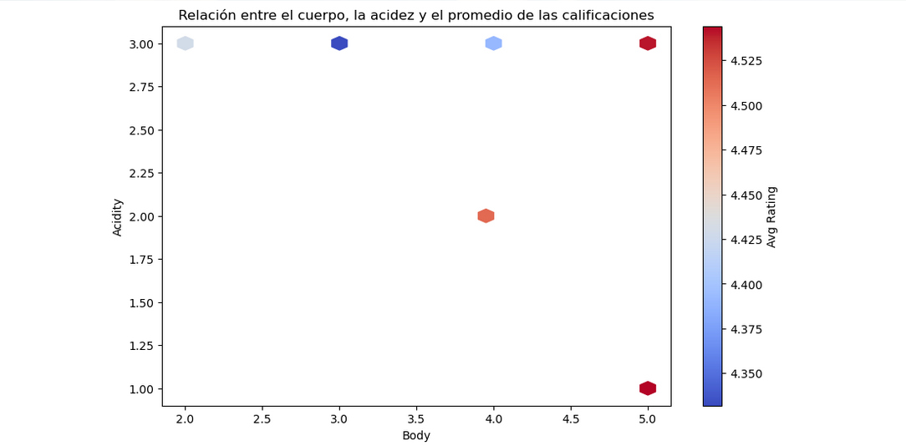
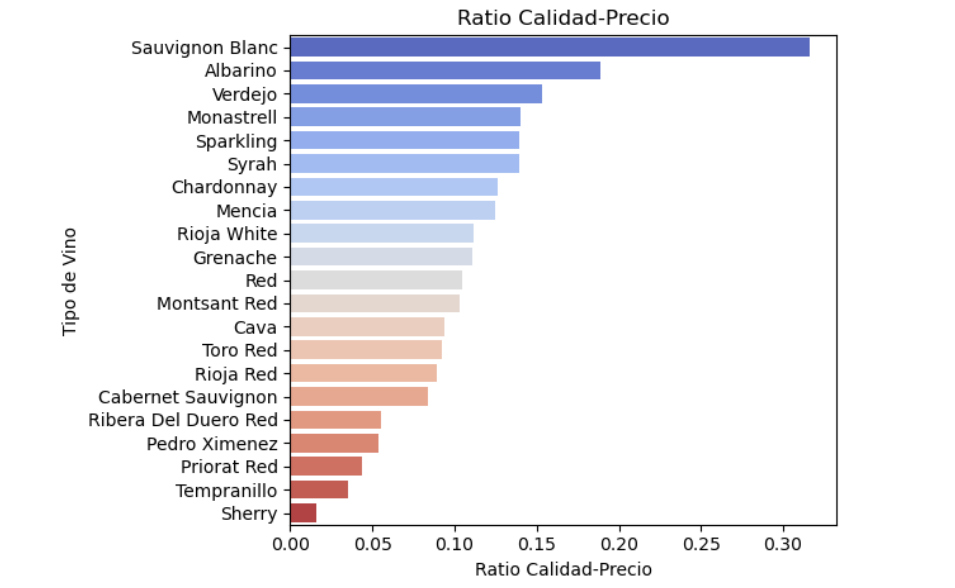
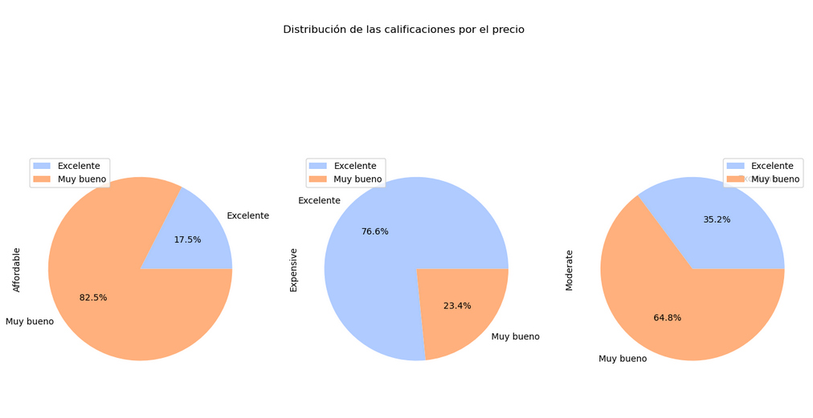

# **Wine Database Project**

This a proyect for Ironhack's Data Analytics bootcamp.

## **Table of Contents**
1. [Introduction](#introduction)
2. [Data Collection](#data-collection)
3. [Data Cleaning](#data-cleaning)
4. [Database Design](#database-design)
5. [SQL Queries](#sql-queries)
6. [Visualizations](#visualizations)
7. [Challenges and Conclusions](#challenges-and-conclusions)

---

## **Introduction**

This project focuses on creating a structured database for analyzing wine data. 
The topic was chosen due to the growing interest in wine analytics and the potential to uncover insights about wine characteristics, pricing, and regions.

**Project Objectives**:
- Design a database.
- Clean and prepare the data for structured storage.
- Execute SQL queries to derive insights.
- Visualize key findings using charts and graphs.

---

## **Data Collection**

The dataset used is [Spanish Wine Quality Datase](https://www.kaggle.com/datasets/fedesoriano/spanish-wine-quality-dataset).

It containing details about:
- Wineries and regions.
- Types of wines.
- Wine characteristics like body, acidity, and price.

This dataset was selected for its depth of information and relevance to the topic.

---

## **Data Cleaning**

Before designing the database, the dataset underwent several cleaning steps:

 -Unnecessary columns were removed.

 -Handling missing values.

 -Dropping duplicate entries.

 -Data standardization.


---

## **Database Design**

The database consists of the following tables:

1. **Wines**:
   - 
2. **Wineries**:
   - 
3. **Types**:
   -
4. **Ratings**:
   - 
5. **Designations**:
   - 

## **ERD diagram** 

---

## **SQL Queries**

Some of the key SQL queries written during the project include:

1. ** **:
   ```sql
   

2. ** **:
    ```sql
   

3. ** **:
    ```sql
    
    
    

## **Visualizations**
Created using Python's Matplotlib.

- **Average rating by region**


- **Top 50 wineries**


- **Relationship between price category and average ratings**


- **Evolution of the total number of wines and ratings by year**


- **Relationship between body, acidity, and average ratings**


- **Quality-price ratio**


- **Distribution of ratings by price**



---

## **Challenges and Conclusions**

### **Challenges**
1. **Theme election**:
   
2. **Importing existing data from csv files into MySQL WorkBench tables**:
   
3. **Data Integration**:
   - Linking the relationships between tables while maintaining data integrity was complex.

---

### **Conclusions**

- SQL is a powerful tool for analyzing relational data in structured domains like wine analytics.
- The structured database lays the foundation for advanced analytics and visualizations.

---

## **Future Improvements**

1. **Additional Data**:
   - Incorporate international wine datasets for a global analysis.
2. **Advanced SQL Queries**:
   - Implement window functions and CTEs for deeper insights.
3. **Interactive Dashboards**:
   - Use tools like Tableau or Power BI for dynamic visualizations.

---


## 👥 Project Members

| Name            | GitHub Profile    |
|-----------------|-------------------|
| Alicia Caminero | [Alicia Caminero](https://github.com/aliciacaminero) |
| Andrea Lafarga  | [Andrea Lafarga](https://github.com/AndreaLaHe)  |
| Gema Villena    | [Gema Villena](https://github.com/GemaVNZ)    |
| Silvia Alonso   | [Silvia Alonso](https://github.com/datasilvia)   |


Feel free to reach out with any question, feedback or contribution to the project!